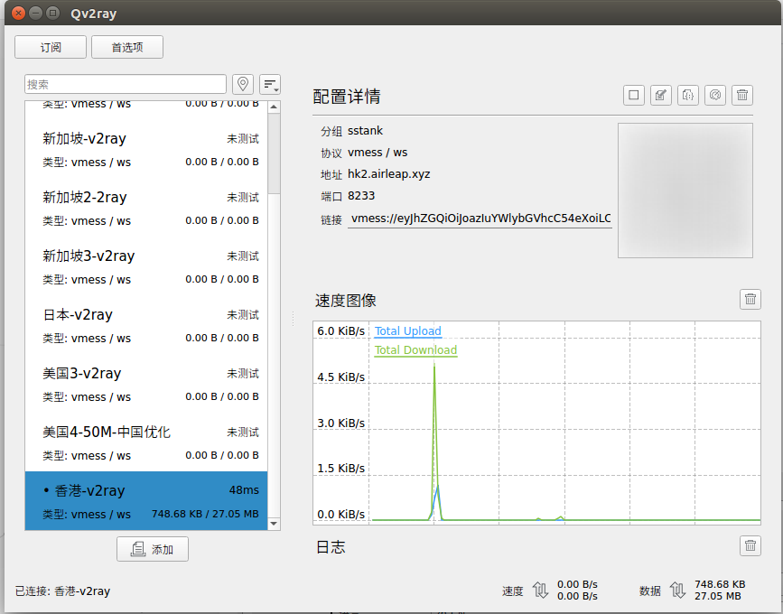
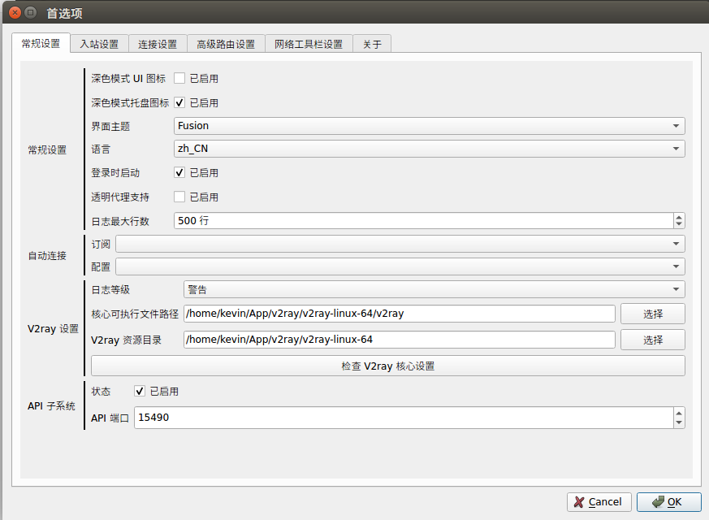
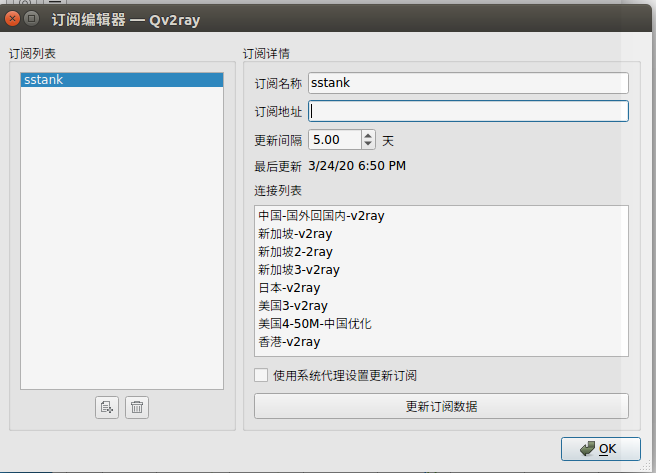

# Ubuntu 16.04 V2Ray 配置.

```
Yunfan REN
renyunfan@outlook.com
测试系统： Ubuntu 16.04
```

#### 1 下载

下载文件`Qv2ray.v2.3.2.linux-x64.AppImage` 和 `v2ray-linux-64.zip`

#### 2 创建目录

```bash
mkdir v2ray
cd v2ray
```

#### 3 解压`v2ray-linux-64.zip`

#### 4 打开终端，进入所在目录

```bash
#进入v2ray下载的根目录，
cd v2ray
# 执行以下命令：
sudo chmod +x ./Qv2ray.v2.3.2.linux-x64.AppImage
# 仍然在v2ray根目录下打开终端，输入以下命令启动软件
./Qv2ray.v2.3.2.linux-x64.AppImage
```

#### 5 配置V2ray地址

在主界面点击首选项



在v2ray设置里设置可执行文件路径和资源目录，二者都来自于刚刚解压的压缩包



在入站设置第二行勾选`设置系统代理`


#### 6 添加订阅

回到主界面点击订阅



`订阅名称`随意填写，`订阅地址`填写你购买的v2ray地址。

点击`更新订阅数据`

随后回到主界面点击左侧对应通道就可以开始科学上网了。

